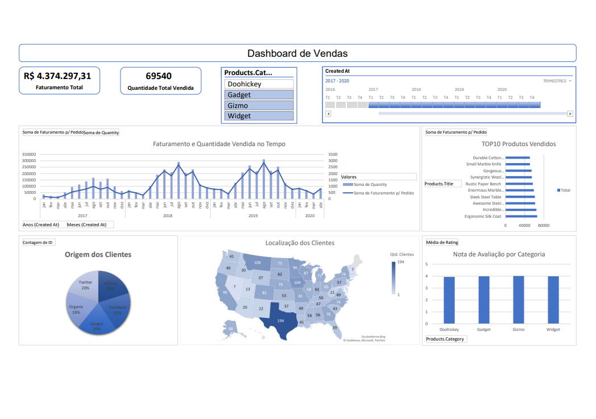
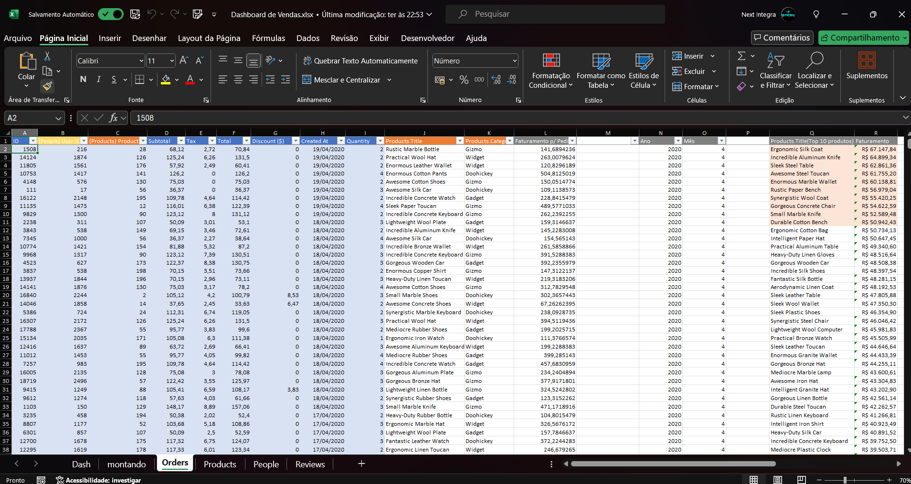
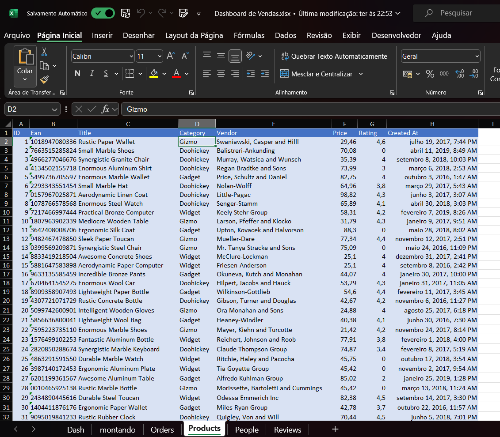
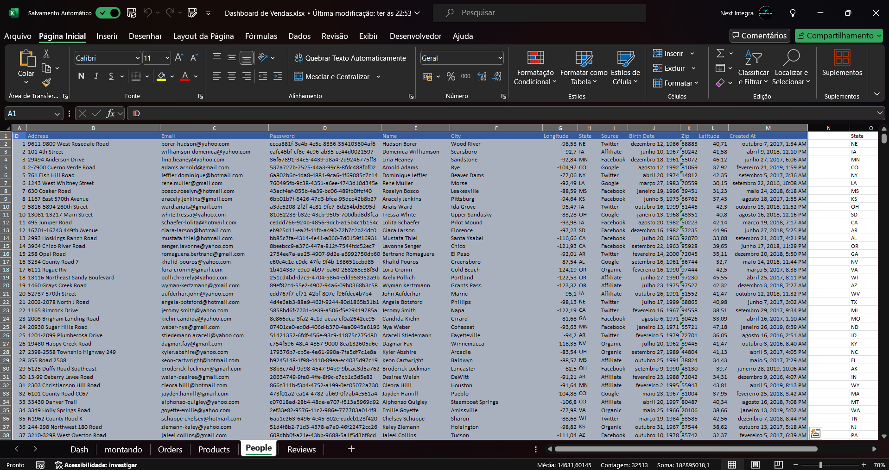
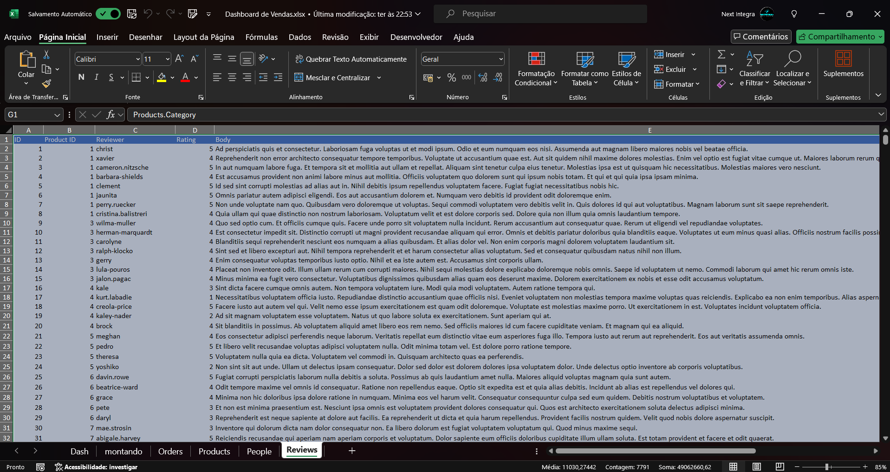

# Projeto de Análise de Vendas na Escola DNC



## Introdução

Este projeto foi desenvolvido como parte do curso na Escola DNC, utilizando o Excel 2016 para análise de dados de vendas. O objetivo é aplicar técnicas de tratamento, formatação e análise de dados para obter insights valiosos sobre o desempenho de vendas.

## Funcionalidades

- **Análise de Faturamento**: Cálculo do faturamento total gerado pelas vendas.
- **Quantidade Vendida**: Análise do volume total de produtos vendidos.
- **Ticket Médio**: Cálculo do valor médio gasto por cliente.
- **Produtos Mais Vendidos**: Identificação dos produtos com maior volume de vendas.
- **Origem dos Clientes**: Mapeamento da origem dos clientes.
- **Avaliação por Categoria**: Análise da satisfação dos clientes por categoria de produto.

## Visualizações

O projeto inclui diversas visualizações, como gráficos de barras, gráficos de setores, e mapas, que ajudam a compreender melhor os dados de vendas e a origem dos clientes.







## Instalação

Para visualizar e interagir com os dados, siga os passos abaixo:

1. Clone o repositório:
   ```sh
   git clone https://github.com/SEU_USUARIO/analise-de-vendas-dnc.git

2. Abra o arquivo Dashboard de Vendas.xlsx no Excel 2016 ou versão superior

## Uso

### Exemplos de Uso

- **Análise de Faturamento:** Utilize o gráfico de faturamento para identificar picos de vendas.
- **Produtos Mais Vendidos:** Consulte a tabela de produtos mais vendidos para ajustar o estoque e estratégias de marketing.

## Contribuição

Contribuições são bem-vindas! Siga os passos abaixo para contribuir:

1. Faça um fork do projeto.
2. Crie uma branch para sua feature (git checkout -b feature/nova-feature).
3. Commit suas mudanças (git commit -m 'Adiciona nova feature').
4. Faça um push para a branch (git push origin feature/nova-feature).
5. Abra um Pull Request.

## Licença
Este projeto está licenciado sob a Licença MIT. Veja o arquivo LICENSE para mais detalhes.

## Contato
Para mais informações, entre em contato:

- **Nome:** Leonardo Alves da Cunha
- **Email:** <leonardoallves1992@gmail.com>
- **LinkedIn:** <https://www.linkedin.com/in/leo-cunha-allves/>